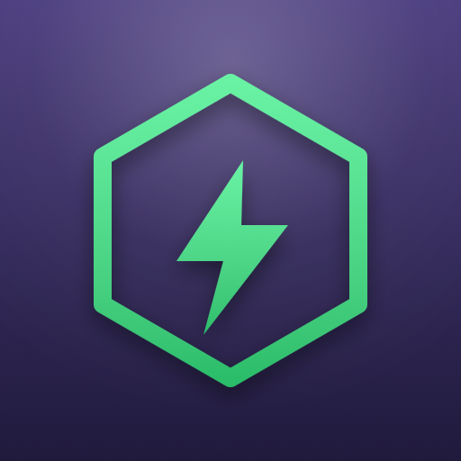

# Renogy Gateway for Home Assistant

A Home Assistant custom integration for Renogy ONE Core power systems,
talking to the same private "DC Home" gateway API used by the official
Renogy phone app. It surfaces telemetry (battery, charger, distribution box
channels, tanks, temperatures, TPMS) as sensors, exposes real load
switches/dimmers as controls, and curates device settings (charge limits,
alarm thresholds, battery type, and similar) as configuration entities.

> **Unofficial.** This integration talks to Renogy's private mobile-app API,
> which has been reverse-engineered for interoperability and is not publicly
> documented or supported by Renogy. It is not affiliated with or endorsed by
> Renogy. The API can change without notice and break this integration.

## Prerequisites

- A Renogy ONE Core gateway already set up and working in the Renogy DC Home
  app.
- Your Renogy account email and password (the same ones used in the app).
- Home Assistant with [HACS](https://hacs.xyz/) installed.

## Installation

This integration is not in the default HACS store, so add it as a custom
repository:

1. In Home Assistant, go to **HACS → Integrations**.
2. Click the **⋮** menu (top right) → **Custom repositories**.
3. Add this repository's URL: `https://github.com/tdack/ha-renogy-gateway`
4. Category: **Integration**.
5. Find "Renogy Gateway" in HACS and install it.
6. Restart Home Assistant.

## Configuration

1. Go to **Settings → Devices & services → Add integration**.
2. Search for **Renogy Gateway**.
3. Enter your Renogy account email and password.
4. If your account has more than one gateway, pick the one to add.

Each devices behind the gateway is created in Home Assistant with its
telemetry as sensors, real load channels as switches/lights, and device
settings grouped under the entity Configuration tab.

## Removal

Remove the integration entry from **Settings → Devices & services**, then
remove the repository from HACS if you no longer want updates.

## Support

This is a community project maintained on a best-effort basis. Please file
issues at the [GitHub issue tracker](https://github.com/tdack/ha-renogy-gateway/issues).

## Icon / branding

The icon shown in this README lives in `docs/icon.png` (and `docs/icon.svg`
as the source vector), borrowed from the
[renogy-gateway](https://github.com/troydack/renogy-gateway) dashboard's
favicon. HACS and the Home Assistant integrations page don't read icons from
this repo directly — they pull from the community
[home-assistant/brands](https://github.com/home-assistant/brands) repository.
`brands/custom_integrations/renogy_gateway/` is a staging copy
(`icon.png` 256×256, `icon@2x.png` 512×512) in the exact layout that repo
expects, ready to submit as a PR there to make the icon show up in HA/HACS
itself.
